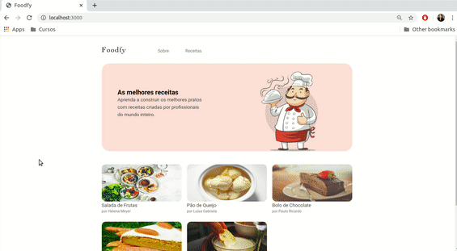

# Foodfy - versão 3

## Descrição
Desafio refatorado em frontend, proposto pelo programa Launchbase da Rocketseat, desenvolvido utilizando HTML 5, CSS 3 e JavaScript, com as funcionalidades e pastas organizadas e construída a parte administrativa. 

Utilizamos também a template engine nunjucks para reaproveitamento de código. 

## Índice
- [Requisitos](#Requisitos)
- [Instalação](#Instalação)
- [Uso](#Uso)
- [Explicação](#Explicação)
- [Erros](#Erros)


## Requisitos
- Siga os passos de instalação abaixo. 


## Instalação
- Utilizar o comando
  - No terminal, utilizar o comando: 
  ``` 
  npm install 
  ```
Obs: Ele é responsável por instalar todas as dependências de desenvolvimento utilizadas no projeto. Elas serão responsáveis pelo seu funcionamento correto.  


## Uso
Para rodar a aplicação:
- No terminal, utilize o comando:
```
npm start
```
- A aplicação deverá abrir no endereço: 

http://localhost:3000
## Explicação:

Nessa versão o projeto possui duas telas principais, a visualizada pelos clientes e uma parte administrativa, acessada exclusivamente pelas rotas.


Acessos:
- página administrativa principal, utilize o endereço: http://localhost:3000/admin/recipes
- página de visualizaçao dos clientes, utilize o endereço: http://localhost:3000

Apresentação em vídeo:


<p align="center">
  
</p>


## Erros
Como a aplicação ainda está em desenvolvimento e terá novas versões, é possível encontrar alguns bugs. 

Caso haja muita lentidão entre as funcionalidades, sugiro que você pare o servidor (ctrl + c) e o inicie novamente com npm start - uma nova aba abrirá.

Caso você não queira reiniciar o servidor, um ctrl + r atualizará a página e pode resolver o problema de lentidão.

Você pode acompanhar as alterações que esta fazendo no arquivo ```data.json``` na pasta raíz, ele mostrará o array com membros e instrutores. Ali você pode ver também os perfis deletados e as edições realizadas.

